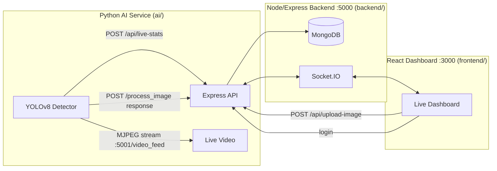

# 🚦 Crowd Monitoring & Safety System

A real-time crowd density monitoring platform that combines **YOLOv8 person detection**, a **Node.js/Socket.IO backend**, and a **React dashboard** to give Control Room and Security teams live visibility into crowd density across multiple camera feeds — with SMS alerting, historical trends, and on-demand image analysis.

---

## ✨ Features

- **Role-based portals** — separate logins for **Control Room** (full dashboard + settings) and **Security Personnel** (reporting tools), plus a no-login **Public View** for a read-only live dashboard.
- **Live crowd detection** — a Python service runs YOLOv8 on one or more camera feeds, counts people per frame, estimates density (`LOW` / `MEDIUM` / `HIGH`), and pushes results to the dashboard in real time via Socket.IO.
- **Live annotated video feed** — Control Room can watch the actual processed camera stream (with bounding boxes drawn) directly in the browser.
- **On-demand image upload & analysis** — Security can upload a photo from the field; it's run through the same YOLO pipeline and the annotated result + people count is broadcast live to Control Room.
- **Configurable density thresholds** — adjust what counts as `LOW`/`MEDIUM`/`HIGH` from the Settings tab, persisted in MongoDB.
- **Historical charts** — live crowd-count line chart and a spatial density heatmap of the campus.
- **SMS alerts** — automatic Twilio SMS when a camera crosses into `HIGH` density.

---

## 🏗 Architecture



- **`ai/`** — OpenCV + YOLOv8 detection loop. Posts stats to the backend, serves a live MJPEG video stream on its own port, and exposes a single-image analysis endpoint for uploads.
- **`backend/`** — Express REST API + Socket.IO server + MongoDB models. Bridges the AI service and the frontend, handles auth, thresholds, and history.
- **`frontend/`** — React dashboard with role-based views (Control Room / Security / Public), live charts, heatmap, and video display.

---

## 🧰 Tech Stack

| Layer      | Technology |
|------------|------------|
| AI / CV    | Python, OpenCV, [Ultralytics YOLOv8](https://github.com/ultralytics/ultralytics), Flask (video streaming) |
| Backend    | Node.js, Express, Socket.IO, MongoDB (Mongoose), JWT, bcrypt, Multer |
| Frontend   | React, Recharts, Socket.IO client |
| Alerts     | Twilio SMS |

---

## 📁 Project Structure

```
FINAL-Crowd/
├── ai/
│   ├── crowd_detection.py     # YOLOv8 detection loop + Flask streaming/upload server
│   ├── yolov8n.pt             # YOLOv8 nano weights
│   ├── requirements.txt
│   └── .env.example
├── backend/
│   ├── server.js              # Express + Socket.IO API
│   ├── Seed.js                # Seeds Control Room & Security accounts
│   ├── models/
│   │   ├── User.js
│   │   └── CrowdStat.js
│   ├── package.json
│   └── .env.example
├── frontend/
│   ├── src/
│   │   ├── App.js             # Main dashboard (live view, video feed, uploads)
│   │   ├── Login.js           # Portal selection + login form
│   │   ├── History.js
│   │   ├── Settings.js
│   │   └── Crowdheatmap.js
│   └── package.json
└── README.md
```

---

## 🚀 Getting Started

### Prerequisites

- [Node.js](https://nodejs.org/) (v18+)
- [Python](https://www.python.org/) (3.9+)
- [MongoDB](https://www.mongodb.com/try/download/community) running locally, or a MongoDB Atlas connection string
- A webcam or video source for the AI service
- A [Twilio](https://www.twilio.com/) account (optional — only needed for SMS alerts)

### 1. Clone the repo

```bash
git clone https://github.com/<your-username>/FINAL-Crowd.git
cd FINAL-Crowd
```

### 2. Backend setup

```bash
cd backend
npm install
cp .env.example .env     # then fill in your MONGO_URI
node Seed.js              # creates the initial Control Room & Security accounts
npm start                  # runs on http://localhost:5000
```


### 3. AI detection service

```bash
cd ai
pip install -r requirements.txt --break-system-packages
cp .env.example .env       # fill in your Twilio credentials (optional)
python crowd_detection.py
```

This starts:
- the detection loop (posts live stats to the backend on `http://localhost:5000`)
- a live MJPEG stream at `http://localhost:5001/video_feed/<camera_id>`
- an image-analysis endpoint at `http://localhost:5001/process_image` (used by the Security upload feature)

> Edit the `CAMERAS` dictionary at the top of `crowd_detection.py` to add camera sources (webcam index, RTSP URL, or IP-camera stream URL).

### 4. Frontend setup

```bash
cd frontend
npm install
npm start                  # runs on http://localhost:3000
```

Open `http://localhost:3000`, choose a portal, and log in with the credentials above.

---

## 🔌 API Reference (Backend — `http://localhost:5000`)

| Method | Endpoint | Description |
|---|---|---|
| `POST` | `/api/auth/login` | Authenticate, returns `{ username, role, token }` |
| `POST` | `/api/live-stats` | Called by the AI service with each detection result; broadcasts `live` (and `alert` on HIGH density) over Socket.IO |
| `GET` | `/api/cameras` | List of known camera IDs |
| `GET` | `/api/daily` | Last 100 recorded stats, for history charts |
| `GET` | `/api/thresholds` | Current `LOW`/`MEDIUM` density thresholds |
| `POST` | `/api/thresholds` | Update thresholds (Settings tab); broadcasts `thresholds` |
| `POST` | `/api/upload-image` | Security image upload — forwards to the AI service for analysis, broadcasts `uploadedImage` |

### Socket.IO events (client-side)

| Event | Payload | Purpose |
|---|---|---|
| `live` | `{ camera, people, capacity, density, densityRatio, timestamp }` | Live per-camera stat update |
| `alert` | `{ message }` | Fired when a camera reaches HIGH density |
| `thresholds` | `{ LOW, MEDIUM }` | Broadcast when thresholds are changed |
| `uploadedImage` | `{ camera, people, capacity, density, image, uploadedBy, timestamp }` | Fired after a Security image upload is analyzed |

---

## 🔐 Security Notes

- All secrets (MongoDB URI, Twilio credentials) are loaded from `.env` files, which are **git-ignored** — never commit real `.env` files. Only `.env.example` templates are tracked.
- Passwords are hashed with `bcrypt` before being stored; JWT is used for session tokens.
- Before deploying publicly, change the seeded default passwords and the JWT signing secret in `server.js`.

---

## 🗺 Roadmap / Ideas

- Persist uploaded-image analyses to history (currently only the most recent upload is kept in memory)
- Multi-camera grid view in the Live tab
- Role-based access control refinements (e.g., admin-only settings)
- Dockerize backend + AI service for easier deployment

---

## 📄 License

This project is available under the MIT License — see [`LICENSE`](LICENSE) for details.

---

## 🙏 Acknowledgments

- [Ultralytics YOLOv8](https://github.com/ultralytics/ultralytics) for the detection model
- [Recharts](https://recharts.org/) for dashboard charts
- [Socket.IO](https://socket.io/) for real-time communication
