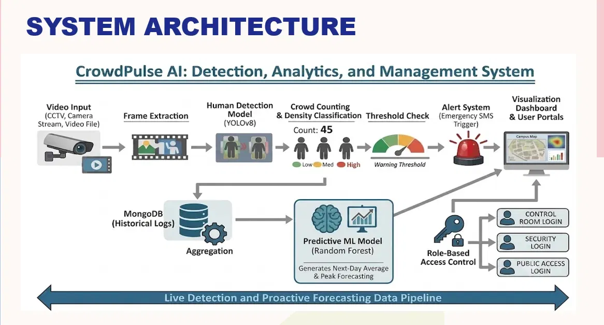
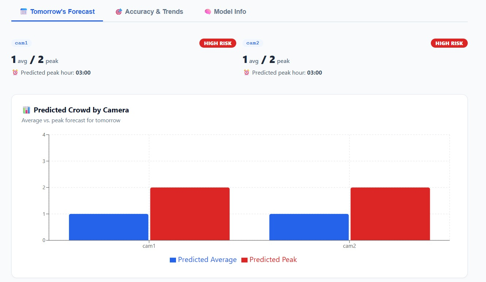
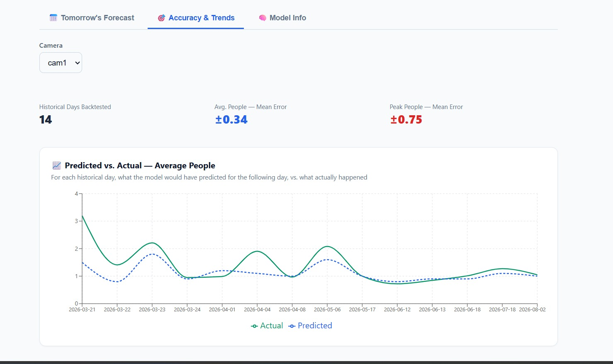
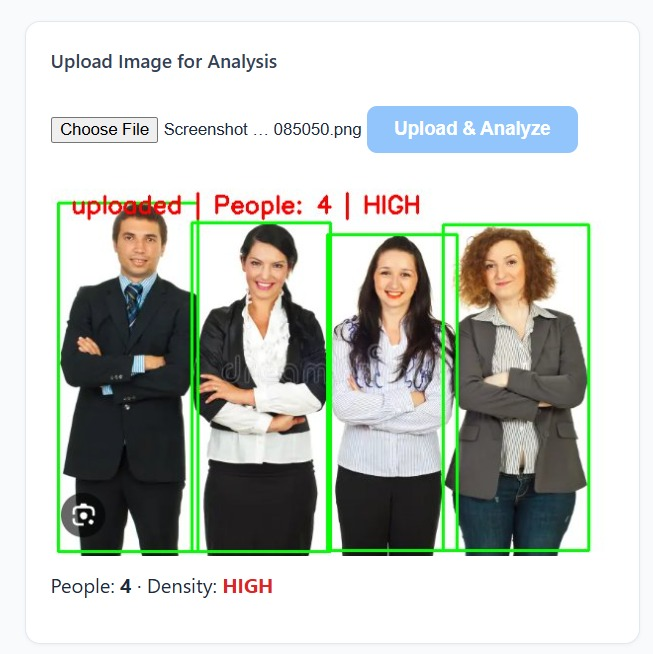
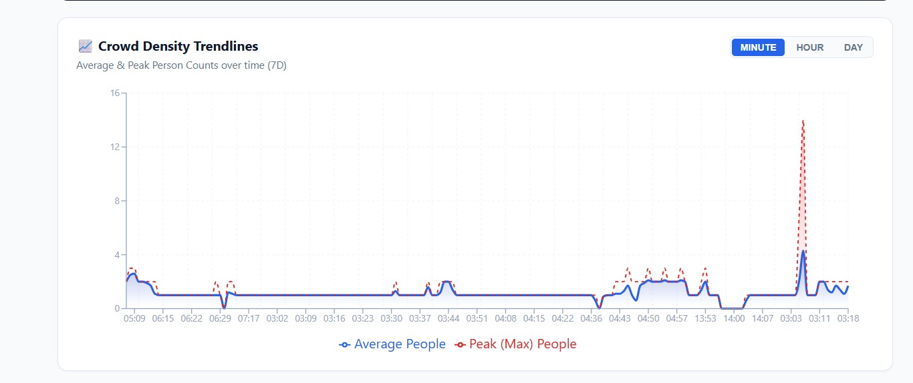
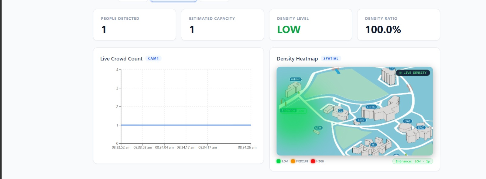

# 🚦 Crowd Management System

Real-time crowd monitoring platform combining computer vision, a live full-stack dashboard, and a machine learning forecasting engine — built to detect, visualize, and predict crowd density across multiple locations.

**🔗 Live Demo:** [crowd-dashboard.onrender.com](https://crowd-dashboard.onrender.com)

       

---

## What it does

- Detects and counts people in live camera feeds using **YOLOv8**, classifying each location as LOW/MEDIUM/HIGH risk based on a capacity-driven density ratio
- Streams the live annotated video feed and real-time stats to a **React dashboard** over Socket.IO — no polling, no refresh
- Sends automated **SMS alerts** (Twilio) when density crosses a threshold
- Lets field staff upload on-ground photos, auto-analyzed through the same detection pipeline and merged into a live spatial heatmap
- Aggregates raw detections into hourly/daily stats via a scheduled job, powering a full analytics dashboard of historical trends
- Forecasts **next-day crowd levels** per location with a trained ML model, and tracks its own prediction accuracy over time against real outcomes
- Serves three role-based portals — Control Room, Security, and Public — with JWT auth

## Why it's interesting

- **Real-time systems**: live video streaming, WebSocket-based state sync, and sub-second alerting across a multi-service architecture
- **Full ML lifecycle, not just a model**: automated dataset generation from production data → cross-validated model selection → deployment as an independent microservice → live accuracy tracking against ground truth
- **Distributed, decoupled services**: detection (Python/Flask), API (Node/Express), and prediction (Python/Flask) run and scale independently, communicating over REST/WebSockets
- **Production concerns handled**: TTL-based data retention, role-based access control, scheduled aggregation jobs, and a system designed so the compute-heavy part (camera detection) can run anywhere while the rest stays cloud-hosted

---

## Workflow

Raw detections are continuously rolled up into pre-aggregated hourly/daily statistics, so analytics queries stay fast even as historical data grows:



## Screenshots

|  |  |  |
|:---:|:---:|:---:|
| **Next-Day Crowd Forecast** | **Prediction Accuracy Tracking** | **Security Upload & Detection** |

|  |  |
|:---:|:---:|
| **Crowd Density Trendlines** | **Live Dashboard & Heatmap** |

## Tech Stack

| Layer | Stack |
|---|---|
| **Computer Vision** | Python, OpenCV, YOLOv8, NumPy |
| **Backend** | Node.js, Express, Socket.IO, MongoDB/Mongoose, JWT, node-cron |
| **ML** | scikit-learn (Random Forest), pandas, PyMongo, Flask |
| **Frontend** | React, Recharts/Chart.js, Socket.IO client |
| **Alerts** | Twilio API |

## Quick Start

```bash
# Backend
cd backend && npm install && npm start

# Frontend
cd frontend && npm install && npm start

# ML prediction service
cd ml && pip install -r requirements.txt
python dataset_generator.py && python train_model.py && python predictor.py

# AI detection (needs a camera)
cd ai && pip install -r requirements.txt
python crowd_detection.py
```

## Project Structure

```
├── ai/         # YOLOv8 detection + live video streaming
├── backend/    # Express API, Socket.IO, auth, scheduled aggregation
├── ml/         # Dataset generation, model training, prediction service
└── frontend/   # React dashboard (3 role-based portals)
```

---

⭐ If you find this useful, a star is appreciated.
